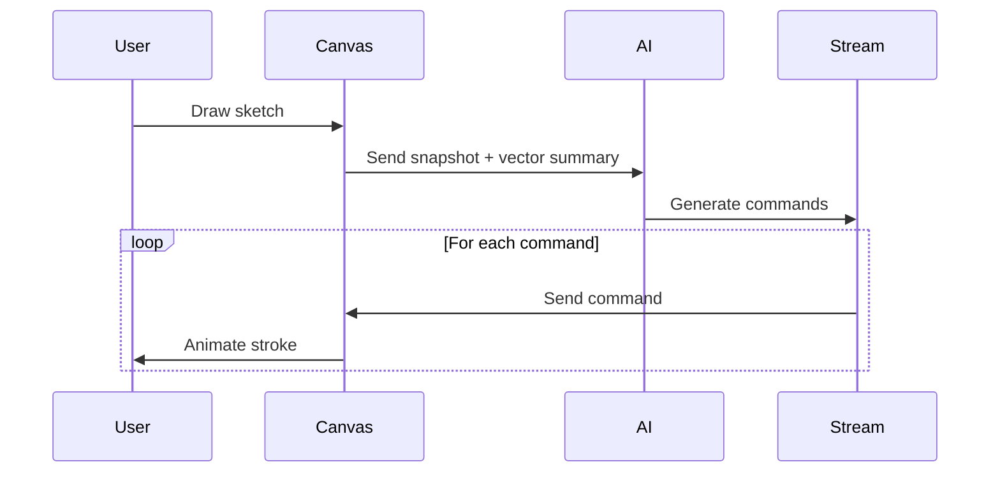

# React Native Drawing App

A creative drawing application built with React Native and Skia, featuring AI-assisted drawing capabilities.

## Features

- Freehand drawing with smooth paths
- Pan and zoom canvas navigation
- AI-assisted drawing with "riff" feature
- Real-time stroke animation
- Support for various shape commands

## Getting Started

### Prerequisites

- Node.js 14+
- React Native development environment
- OpenAI API key

### Installation

1. Clone the repository
2. Install dependencies:
   ```bash
   npm install
   ```
3. Set up environment variables:
   ```bash
   # .env
   EXPO_PUBLIC_OPENAI_API_KEY=your_api_key_here
   ```

## Architecture

### Drawing Canvas

The main drawing canvas is implemented using `@shopify/react-native-skia` for high-performance rendering. It supports:

- Touch-based drawing
- Multi-finger pan gestures
- Dynamic path creation
- Vector command processing

### AI Riff Feature

The "riff" feature analyzes your sketch and generates creative additions that complement your style:



Key components:
1. Light-weight canvas snapshot (~40kB JPEG)
2. Vector-style drawing summary
3. Streaming AI response
4. Real-time stroke animation

### Performance

The riff feature is optimized for low latency:
- First stroke appears < 3s after request
- 25fps stroke animation
- Fallback support for non-streaming environments

## Troubleshooting

### Common Issues

1. Stream not working behind corporate proxy
   - Solution: The app will automatically fall back to non-streaming mode

2. Drawing commands out of bounds
   - Solution: All coordinates are automatically clamped to canvas size

## Contributing

1. Fork the repository
2. Create your feature branch
3. Commit your changes
4. Push to the branch
5. Create a Pull Request

## License

This project is licensed under the MIT License - see the LICENSE file for details.

## Setup

1. **Start the development server**:
   ```bash
   npx expo start
   ```

2. **Run on device/simulator**:
   - Scan the QR code with Expo Go app (iOS/Android)
   - Press `